# Airline Ranking - TEXAS Jan 2017

Insights on causes of flight delays and implementation of Airline carrier ranking (quality of service) system based

on data on flights to and from Texas from Bureau of Transportation during Jan 2017.

Using Python, Pandas, PandaSQL, Geoplotlib, Matplotlib, Seaborn, etc.

[Goto Code folder for SQL Queries and visualization in Python](code)

## DATASET AND ATTRIBUTES

Our dataset includes 80 fields spanning over 11 categories which are,

- Time Period
- Airline
- Origin
- Destination
- Departure Performance
- Arrival Performance
- Cancellation and Diversion
- Flight Summaries
- Cause of delay
- Gate return information at origin airport
- Diverted airport information

From the original Data set, we have extracted data that are significant for our analysis,

after that the reduced data set contained, 80988 Rows and 26 Fields.

## FIELDS

<table align="center">
	<tr align="center">
		<td>Attribute Name</td>
		<td>Description</td>
	</tr>
	<tr align="center">
		<td>FL_DATE</td>
		<td>Flight Date (MM/DD/YYYY)</td>
	</tr>
	<tr align="center">
		<td>CARRIER</td>
		<td>Code assigned by IATA and commonly used to identify a carrier. As the same code may have been assigned to different carriers over time, the code is not always unique. For analysis, use the Unique Carrier Code.</td>
	</tr>
	<tr align="center">
		<td>FL_NUM</td>
		<td>Flight Number</td>
	</tr>
	<tr align="center">
		<td>ORIGIN</td>
		<td>Origin Airport</td>
	</tr>
	<tr align="center">
		<td>ORIGIN_CITY</td>
		<td>Origin City</td>
	</tr>
	<tr align="center">
		<td>ORIGIN_CITY_NAME</td>
		<td>Origin Airport, City Name</td>
	</tr>
	<tr align="center">
		<td>DEST</td>
		<td>Destination Airport</td>
	</tr>
	<tr align="center">
		<td>DEST_CITY_NAME</td>
		<td>Destination Airport, City Name</td>
	</tr>
	<tr align="center">
		<td>DEP_TIME</td>
		<td>Actual Departure Time (local time: hhmm)</td>
	</tr>
	<tr align="center">
		<td>DEP_DELAY</td>
		<td>Difference in minutes between scheduled and actual departure time. Early departures show negative numbers</td>
	</tr>
	<tr align="center">
		<td>ARR_TIME</td>
		<td>Actual Arrival Time (local time: hhmm).</td>
	</tr>
	<tr align="center">
		<td>ARR_DELAY</td>
		<td>Difference in minutes between scheduled and actual arrival time. Early arrivals show negative numbers.</td>
	</tr>
	<tr align="center">
		<td>CANCELLED</td>
		<td>Cancelled Flight Indicator (1=Yes)</td>
	</tr>
	<tr align="center">
		<td>CANCELLATION_CODE</td>
		<td>Specifies the Reason For Cancellation</td>
	</tr>
	<tr align="center">
		<td>DIVERTED</td>
		<td>Diverted Flight Indicator (1=Yes)</td>
	</tr>
	<tr align="center">
		<td>CRS_ELAPSED_TIME</td>
		<td>CRS Elapsed Time of Flight, in Minutes</td>
	</tr>
	<tr align="center">
		<td>ACTUAL_ELAPSED_TIME</td>
		<td>Elapsed Time of Flight, in Minutes</td>
	</tr>
	<tr align="center">
		<td>AIR_TIME</td>
		<td>Flight Time, in Minutes</td>
	</tr>
	<tr align="center">
		<td>DISTANCE</td>
		<td>Distance between airports (miles)</td>
	</tr>
	<tr align="center">
		<td>TAXI_IN</td>
		<td>Taxi In Time, in Minutes</td>
	</tr>
	<tr align="center">
		<td>TAXI_OUT</td>
		<td>Taxi Out Time, in Minutes</td>
	</tr>
	<tr align="center">
		<td>CARRIER_DELAY</td>
		<td>Carrier Delay, in Minutes</td>
	</tr>
	<tr align="center">
		<td>WEATHER_DELAY</td>
		<td>Weather Delay, in Minutes</td>
	</tr>
	<tr align="center">
		<td>NAS_DELAY</td>
		<td>National Air System Delay, in Minutes</td>
	</tr>
	<tr align="center">
		<td>SECURITY_DELAY</td>
		<td>Security Delay, in Minutes</td>
	</tr>
	<tr align="center">
		<td>LATE_AIRCRAFT_DELAY</td>
		<td>Late Aircraft Delay, in Minutes</td>
	</tr>
</table>

## TYPES OF DELAY

ASPM records minutes of delay for five possible causes of flight arrival delays: carrier, weather,
NAS, security, and late arrival. The data are provided by the Bureau of Transportation Statistics(BTS)
for  ASQP  flights  only.  These  causes  of  delay  were  determined  by  the  Department  of
Transportation.

### CARRIER DELAY
Carrier  delay  is  within  the  control  of  the  air  carrier.  Examples  of  occurrences  that  may
determine  carrier  delay  are:  aircraft  cleaning,  aircraft  damage,  awaiting  the  arrival  of
connecting passengers or crew, baggage, bird strike, cargo loading, catering, computer, outage
carrier  equipment,  crew  legality  (pilot  or  attendant  rest),  damage  by  hazardous  goods,
engineering  inspection,  fueling,  handling  disabled  passengers,  late  crew,  lavatory  servicing,
maintenance, oversales, potable water servicing, removal of unruly passenger, slow boarding
or seating, stowing carryon baggage, weight and balance delays.

### LATE ARRIVAL DELAY
Arrival delay at an airport due to the late arrival of the same aircraft at a previous airport. The
ripple effect of an earlier delay at downstream airports is referred to as delay propagation.

### NAS DELAY
Delay that is within the control of the National Airspace System (NAS) may include: nonextreme
weather conditions, airport operations, heavy traffic volume, air traffic control, etc. Delays that
occur after Actual Gate Out are usually attributed to the NAS and are also reported through
OPSNET.

### SECURITY DELAY
Security  delay  is  caused  by  evacuation  of  a  terminal  or  concourse,  reboarding  of  aircraft
because of security breach, inoperative screening equipment and/or long lines more than 29
minutes at screening areas.

### WEATHER DELAY
Weather delay is caused by extreme or hazardous weather conditions that are forecasted or
manifest themselves on point of departure, enroute, or on point of arrival.

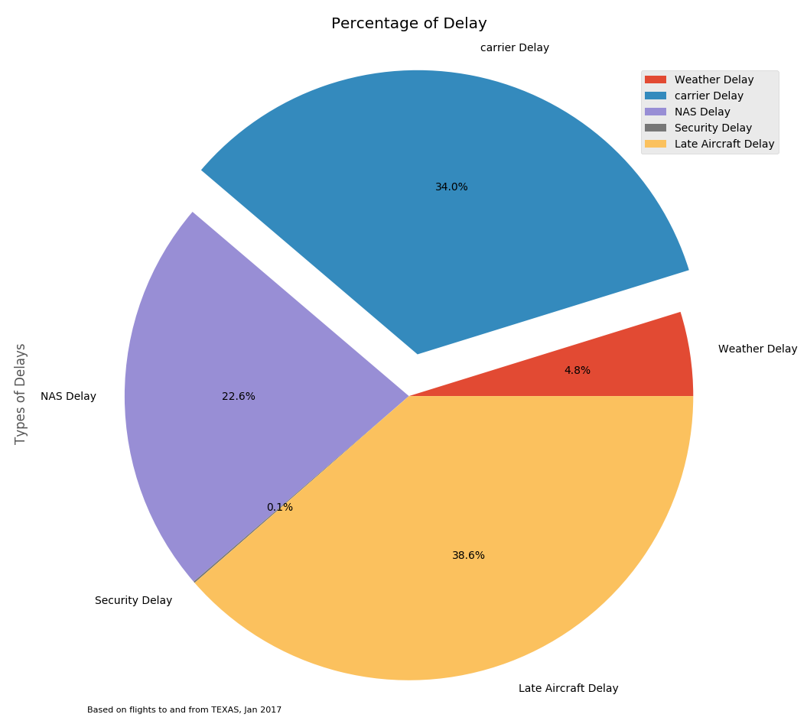

The above pie chart depicts the effect of each type of delays in our data set. Based onthe  above analysis, the late aircraft delay (38.6%), the  Carrier delay (34%)  and NASdelay  (22.6%)  consists  of  most  of  the  delays.  It  is  important  that  the  delays  due  toweather  conditions  is  4.8%  which  is  significantly  less.  Both  Late  Aircraft  delay  andCarrier delays are directly connected to the performance of carrier, so it is evident thatthis  analysis  can  provide  insights  for  the  evaluation  of  carrier  and  can  be  used  forfurther improvement.

## RANKING SYSTEM

To obtain a meaningful and efficient ranking (quality of service) system the following data were considered:

-  Number of airlines for each carrier (flight volume).
-  Speed of the aircrafts in mph.
-  Ratio between operated flights and scheduled flights.
-  Taxi in and Taxi out time (time to leave and enter the gate).
-  The average arrival delay.

We have not included avg. departure delay because usually it depends on the departure airport.
The above data was used to obtain a ratio which indicated a score for the aircrafts rankings. The
aircrafts  airtime  was  used  to obtain  the  speed  of  flight.  After  analyzing  the  speed  of  all  the
aircrafts,  we  found  their  averages  to  be  between  400  and  500  mph.  The  distance  between
source  and  destinations  were  plotted  using  the  arrival  delay  and  departure  delays.  As  an
inference, we came to understand that delay was comparatively higher during short distance
travels. Long distance flights experienced shorter delays. To an extent distance did not affect
the flight delay.
After analyzing the causes of delay -weather delays were almost 4.8% and was the least. The
maximum  delays  were  caused  by  late  aircraft  delay  and  carrier  delay  (due  to  aircraft
maintenance) and was near to 70% together.
All  the  values  were  rescaled  and  normalized  using min_max  scaler  and  thus  all  values  were
between 0 and 1. Due to properties of our ranking system we rescaled between 1 and 2. To
obtain the final ranking, we used a score variable comparing 6 variables which was in turn used
to check the ranking status. I.e. a higher score would lead to a higher ranking which means the
scheduled flight was operated correctly without any delays.
 Score= a /(1+b)
where a is the product of operated flights, total volume of flights and the flight speed and b is
the product of arrival delay, average taxi in and taxi out times. The values of variable a were
directly proportional to Score and the values of b were inversely proportional to score.

## INSIGHTS AND ANALYSIS

### PLOTTING AIRLINE ROUTE OF ENTIRE DATASET
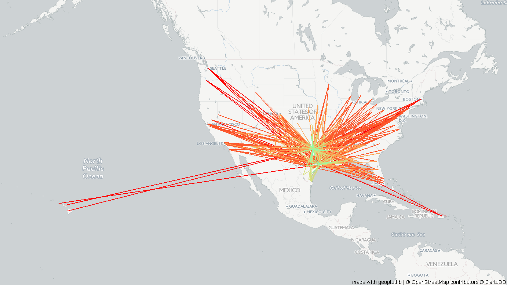

### PLOTTING OF ROUTES WITH NO DELAYS
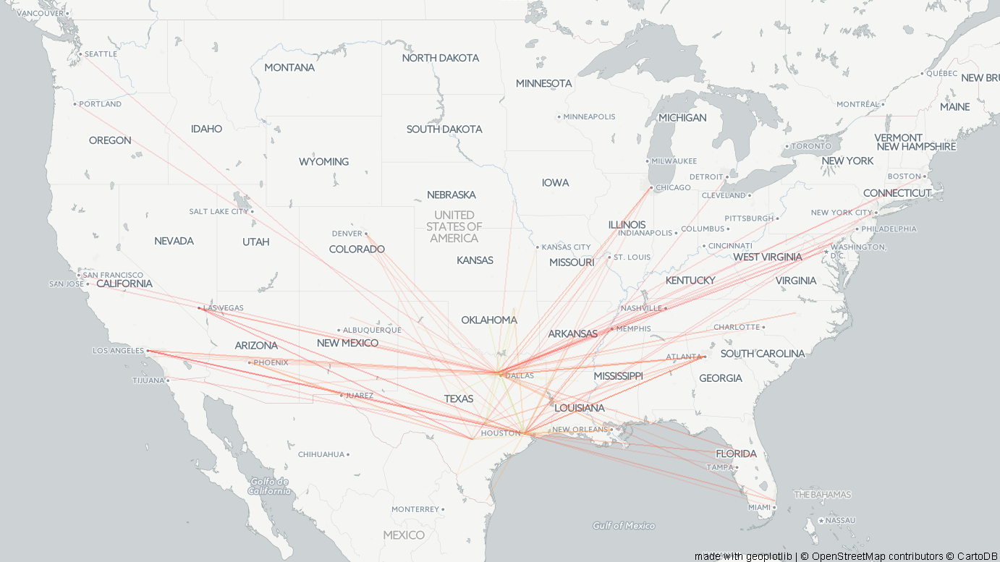

### DISTANCE AGAINST ARRIVAL AND DEPRATURE DELAYS
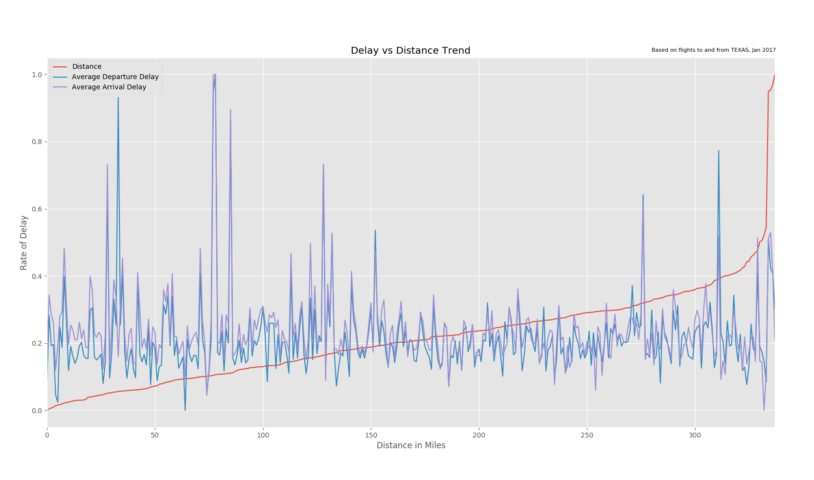

From the graph, it is evident that distance of flight doesn’t have much impact on the delays, even 
though lower distance flight shows relatively higher delay. There for, we can assume that longer
flights might have makeup the delayed minutes during flight.

### SCHEDULED VS ELAPSED TIME OF FLIGHT
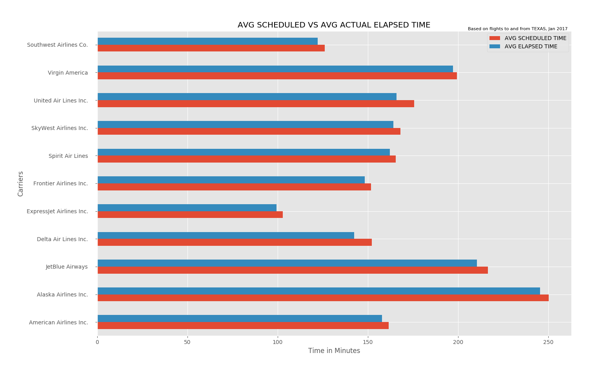

From the Graph, we can see that all carriers have completed the flight before scheduled time.

### TOTAL SCHEDULED VS CANCELLED
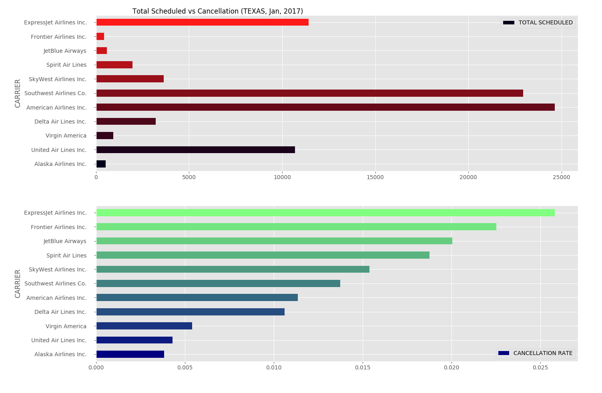

Expresjet Airline and Frontier Airlines has the highest rate of cancellation, which later going to effect
on their rank. From the graph, we can see that American Airlines and Southwest have significant
amount of flights and very less cancellation. From these we can say that their service quality is high
and they will be securing high ranks.

### DELAY CATEGORIES OF EACH CARRIER

From the above bar chart, in each category of delay; American Airlines, Alaskan Airlines, United Airlines
and Southwest airlines has scored very less delays. Fortier Airlines has very high late aircraft delay,
which should be handled and Spirit Airlines has the peek NAS delay which is very less for all other
carriers (they must have investigated on this issue).
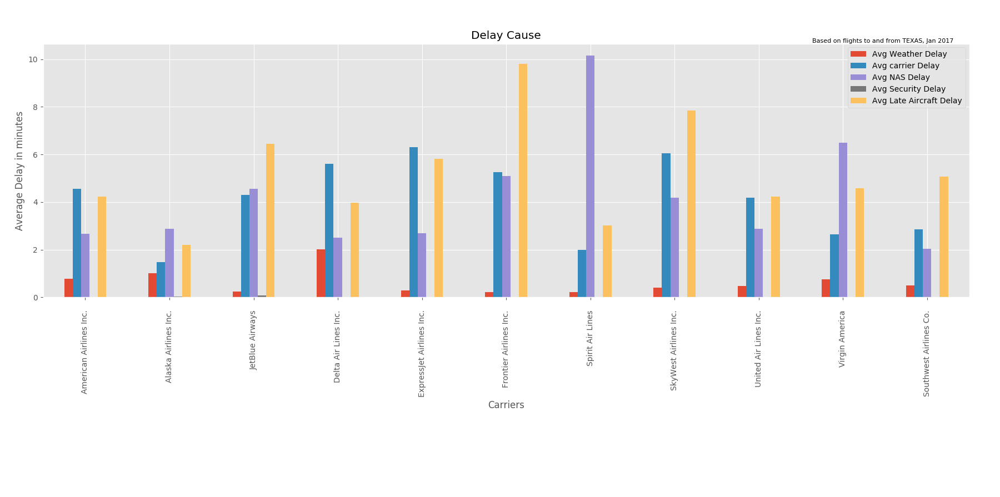

From the below graph, it is evident that Fortier airlines has the highest sum of average of all delays.
And Alaskan Airlines and southwest airlines has lowest.
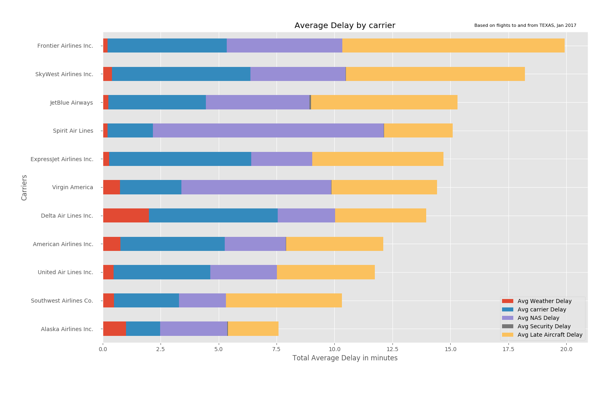

### PERFORMANCE BASED ON ARRIVAL DELAY
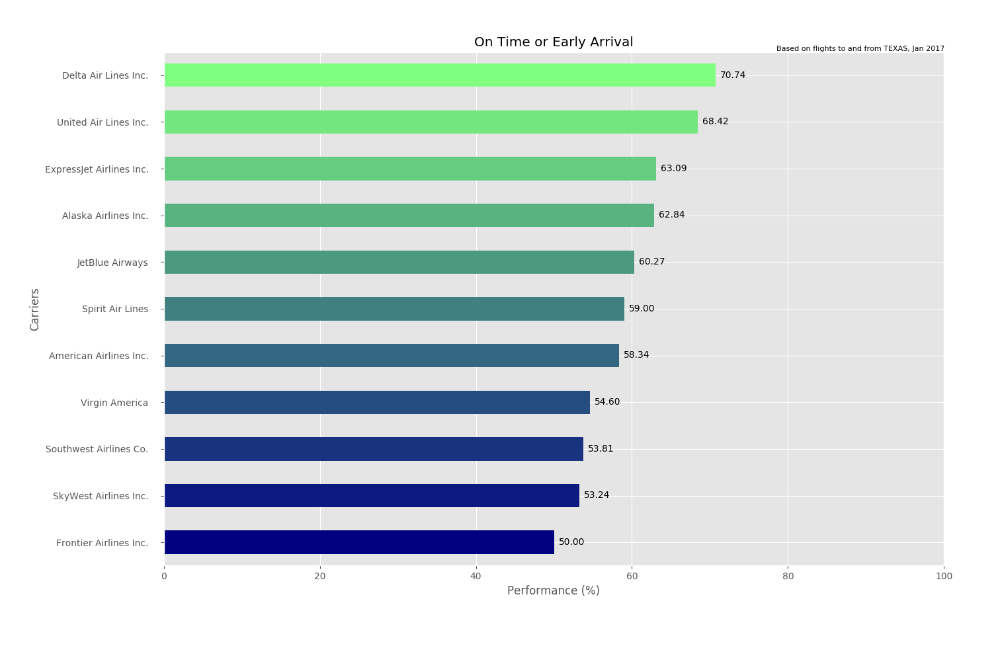

Above, performance graph show that Delta Airlines, united airlines have higher percentage of on
time or early arrival with around 70%. Forntier airlines and skywest Airlines are the low scorers with
around 50% of on time or early arrival.

### FLIGHT VOLUME / TOTAL NUMBER OF FLIGHTS FROM EACH CARRIER
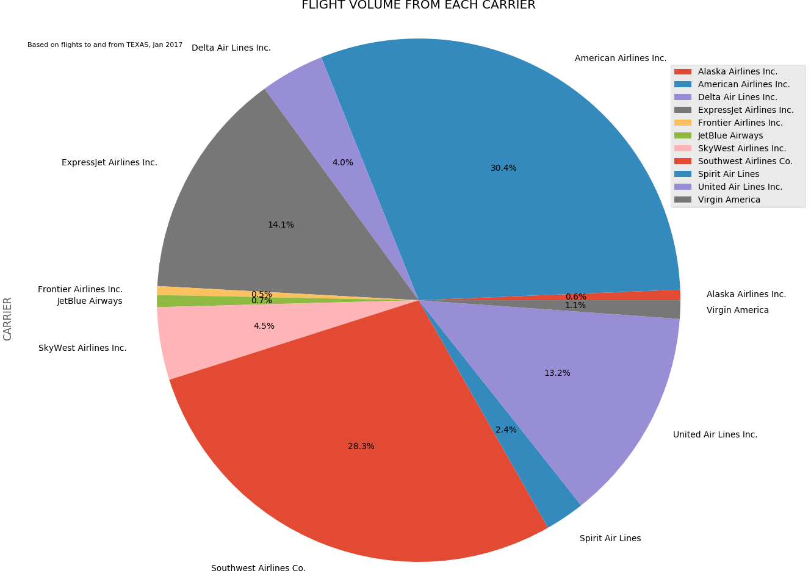

We can see that American Airlines (30.4%) and Southwest airlines (28.3 %) together have the  lion
share of flights to and from TEXAS. Frontier Airlines and JetBlue Airways have the least number of
flights.

### FLIGHT SPEED
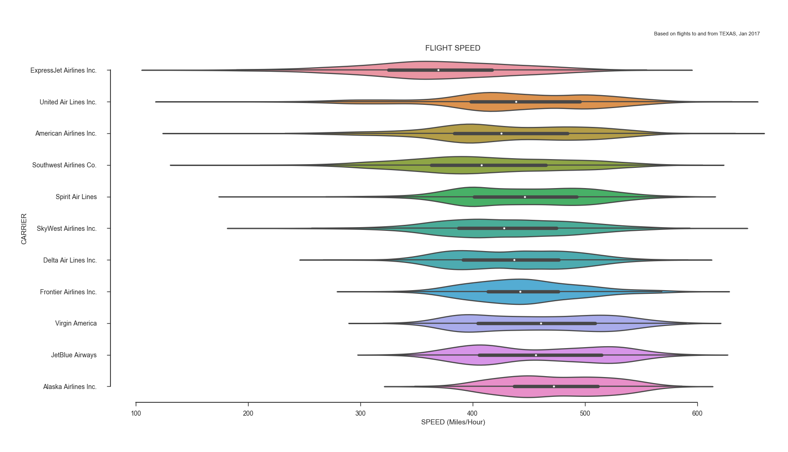

Based on the violin plot, we can see that in average, most flying speed across airlines are close to
400~450 miles per hour; with the ExpressJet Airlines Inc. is the slowest airline and large variation (by
simply looking at the data shape distribution). The fastest service is offered by Alaskan Airlines.
It is interesting to see that, in some rare cases, an aircraft can go as high as 800 miles per hour in
average during a flight trip.

### AVERAGE ARRIVAL DELAY VS DEPARTURE DELAY
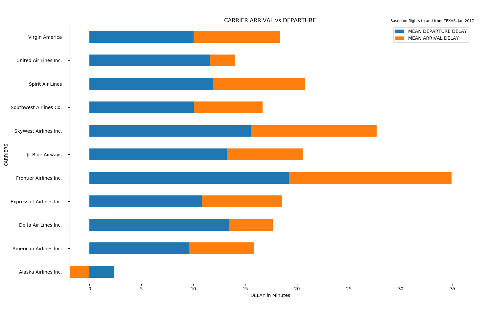

Based on this analysis, we can see that all the lines have longer departure delays than arrival delays,
Frontier Airlines have both delays equal and high. We can say that the flights can adjust speed to
catch up time while departure delay sometimes are out of control.
Skywest Airlines and Frontier Airlines are among the longest arrival and departure delay airlines. It is
worth noting that Alaska Airlines is the only airline among all to arrive the destination earlier than
scheduled in average.

### RATIO OF OPERATED AND SCHEDULED FLIGHTS
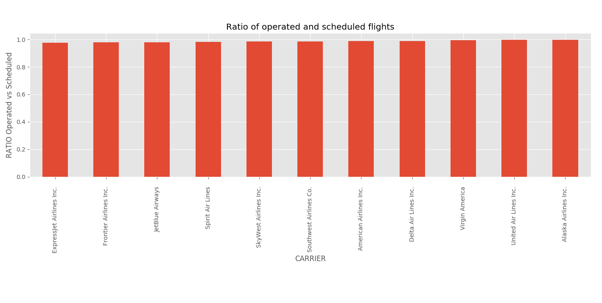

From the graph, we can see that about 98% of scheduled flights are operated, with Expressjet Airlines
with the lowest and Alaskan Airlines with the highest.

### MEAN TAXI IN AND TAXI OUT
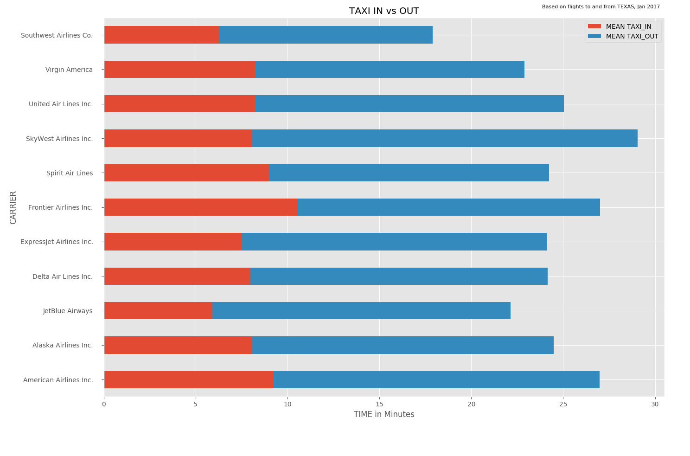

Interestingly, we can see that overall taxi in time is less than taxi out time for all the airlines. All airlines
have an average taxi_in time less than 10 minutes except Frontier Airlines, while all taxi out time are
greater than 10 minutes. Also, it seems Southwest has the shortest taxi-in and taxi-out.

## ANALYSIS RESULT

We have 6 variables which decide  score. The score is proportional to a subset (a) of the variables
whereas being inversely proportional to a different subset (b) of the variables. We used the following
formula for calculating score on normalized data which we scaled between 1 and 2.

<table align="center">
	<tr align="left">
		<td>CARRIER</td>
		<td>RATIO_OP _SCH</td>
		<td>FLIGHT_S PEED</td>
		<td>ARRIVAL_D ELAY</td>
		<td>FLIGHTS_VOL UME</td>
		<td>TAXI_IN</td>
		<td>TAXI_OUT</td>
	</tr>
	<tr align="center">
		<td>Alaska Airlines Inc.</td>
		<td>2</td>
		<td>2</td>
		<td>1</td>
		<td>1.003223673</td>
		<td>1.469513 821</td>
		<td>1.508629 329</td>
	</tr>
	<tr align="center">
		<td>American Airlines Inc.</td>
		<td>1.6572814 63</td>
		<td>1.6413807 91</td>
		<td>1.46460773 9</td>
		<td>2</td>
		<td>1.718027 285</td>
		<td>1.652870 336</td>
	</tr>
	<tr align="center">
		<td>Delta Air Lines Inc.</td>
		<td>1.6917944 26</td>
		<td>1.5749009 06</td>
		<td>1.34913284 5</td>
		<td>1.114151099</td>
		<td>1.442462 476</td>
		<td>1.484923 569</td>
	</tr>
	<tr align="center">
		<td>ExpressJet Airlines Inc.</td>
		<td>1</td>
		<td>1</td>
		<td>1.54974805 5</td>
		<td>1.45404199</td>
		<td>1.344297 793</td>
		<td>1.528606 601</td>
	</tr>
	<tr align="center">
		<td>Frontier Airlines Inc.</td>
		<td>1.1495483 13</td>
		<td>1.7011098 17</td>
		<td>2</td>
		<td>1</td>
		<td>2</td>
		<td>1.514635 009</td>
	</tr>
	<tr align="center">
		<td>JetBlue Airways</td>
		<td>1.2628047 43</td>
		<td>1.7806857 14</td>
		<td>1.52541105 9</td>
		<td>1.006406018</td>
		<td>1</td>
		<td>1.490665 621</td>
	</tr>
	<tr align="center">
		<td>SkyWest Airlines Inc.</td>
		<td>1.4743255 37</td>
		<td>1.5598484 63</td>
		<td>1.79949787</td>
		<td>1.132087948</td>
		<td>1.467007 869</td>
		<td>2</td>
	</tr>
	<tr align="center">
		<td>Southwest Airlines Co.</td>
		<td>1.5492443 28</td>
		<td>1.5073759 97</td>
		<td>1.48646221 4</td>
		<td>1.929285832</td>
		<td>1.069609 378</td>
		<td>1</td>
	</tr>
	<tr align="center">
		<td></td>
		<td>1.3210552 48</td>
		<td>1.7085169 05</td>
		<td>1.61392884 3</td>
		<td>1.063192263</td>
		<td>1.661401 389</td>
		<td>1.385209 54</td>
	</tr>
	<tr align="center">
		<td>United Air Lines Inc.</td>
		<td>1.9785571 95</td>
		<td>1.7848266 35</td>
		<td>1.24498746</td>
		<td>1.423499752</td>
		<td>1.495306 105</td>
		<td>1.554886 169</td>
	</tr>
	<tr align="center">
		<td>Virgin America</td>
		<td>1.9278500 85</td>
		<td>1.8004096 7</td>
		<td>1.58163733 5</td>
		<td>1.019796661</td>
		<td>1.493109 681</td>
		<td>1.323942 818</td>
	</tr>
</table>

Where,

 `a = (RATIO_OP_SCH) * (FLIGHT_SPEED) * (FLIGHTS_VOLUME)` and

`b = (ARRIVAL_DELAY) * (TAXI_IN) * (TAXI_OUT)`

#### `Score = a/(1+b)`

A higher score indicates a better rank.

### RANKING

Based on the score, below are our ranking (quality of service) of Carriers, to and from Texas, Operated during Jan 2017.

- 1. Southwest Airlines Co.
- 2. United Air Lines Inc.
- 3. Alaska Airlines Inc.
- 4. American Airlines Inc.
- 5. Virgin America
- 6. Delta Air Lines Inc.
- 7. JetBlue Airways
- 8. Spirit Air Lines
- 9. SkyWest Airlines Inc.
- 10. ExpressJet Airlines Inc.
- 11. Frontier Airlines Inc.

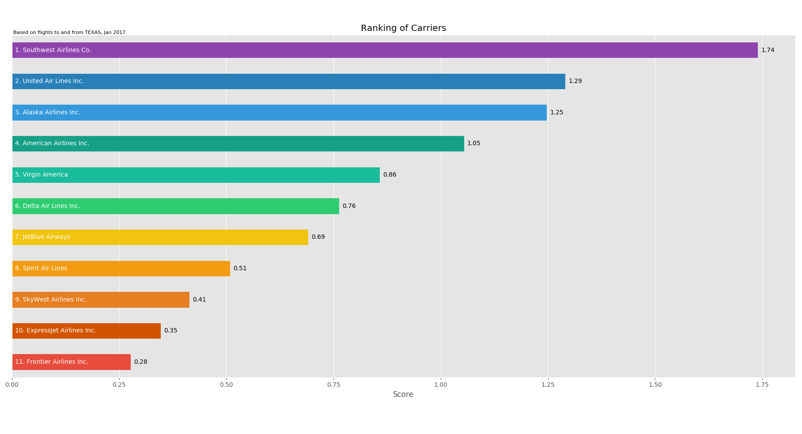

Based on the data, Analysis and visualization we concluded that Southwest Airlines outperformed all
other carriers and secured rank 1.

This lower scored carrier can improve their performance based on this insight and increase quality of
service and thereby gain customer satisfaction.

